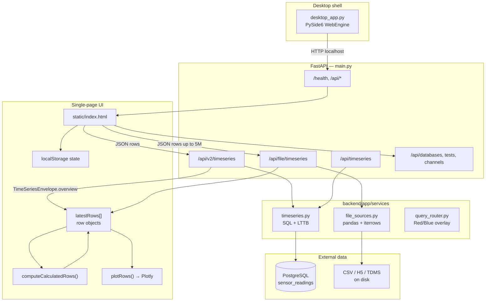
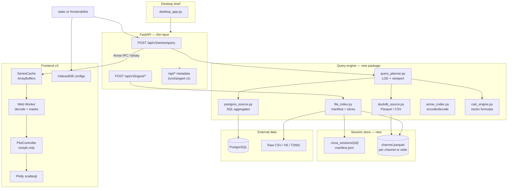
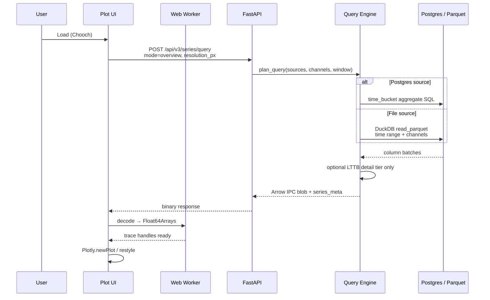
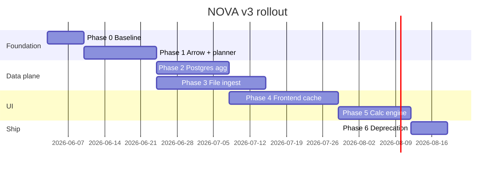

# NOVA v3 Performance Architecture — Implementation Plan

**Status:** Phases 1–6 shipped on `data_overhaul` (Phase 6.4 uPlot evaluation deferred)  
**Date:** 2026-06-03  
**Scope:** Ground-up data-plane upgrade for large telemetry datasets while preserving existing UX (sources, channels, masks, calculated channels, Plotly viewer, desktop launcher).

**Related docs:**

- [2026-05-04 Performance & UI Redesign (spec)](superpowers/specs/2026-05-04-performance-ui-redesign.md) — incremental optimizations already partially implemented
- [2026-05-05 Performance & UI Redesign (plan)](superpowers/plans/2026-05-05-performance-ui-redesign.md) — LTTB, `__ts` cache, zoom refetch tasks

This plan supersedes the *incremental* performance work as the long-term target. Phases 0–1 can be executed in parallel with finishing the 2026-05-05 plan where overlap exists.

---

## 1. Executive summary

NOVA today is a **row-oriented telemetry viewer**: data moves as JSON `TimeSeriesPoint` rows from PostgreSQL or files through FastAPI into a monolithic `index.html` client that holds `latestRows[]` and rebuilds Plotly traces on demand.

The v3 upgrade reframes NOVA as a **telemetry query engine with a viewer attached**:

- **Columnar series** (typed `x`/`y` buffers, Apache Arrow on the wire)
- **Level-of-detail (LOD)** queries driven by viewport width and zoom window
- **Aggregation at the source** (SQL buckets for Postgres; DuckDB/Parquet for files)
- **Indexed file ingest** (no full-file load or `iterrows()` per request)
- **Modular frontend** with Web Workers for calc/plot prep

Users keep the same workflows (add sources, pick tests/channels, Chooch, zoom, calculated channels). Performance improves because the system **never materializes full raw datasets** unless explicitly requested (export / analysis mode).

---

## 2. Key improvements vs current implementation

| Area | Current (v0.x) | Target (v3) | User-visible impact |
|------|----------------|-------------|---------------------|
| **Data unit** | One JSON object per sample (`time`, `value`, metadata) | One series = parallel `float64` arrays + metadata | 10–100× smaller payloads; faster parse/plot |
| **Postgres query** | `SELECT … ORDER BY time LIMIT N` globally, LTTB in Python after fetch | `time_bucket` / per-series caps in SQL; LTTB only for detail tier | Faster Chooch; correct per-channel limits |
| **File sources (CSV/H5/TDMS)** | Full pandas load; `iterrows()` → millions of `TimeSeriesPoint`; client requests up to 5M rows | Ingest → session Parquet + manifest; range/channel slice reads | Large TDMS/CSV opens in seconds, not minutes |
| **Downsampling** | LTTB post-fetch (`timeseries.py`); v2 envelope for Postgres overview only | LOD pyramid: overview / detail / raw; all source types | Smooth zoom on files, not just Postgres |
| **Client memory** | `latestRows[]` holds all loaded points | `SeriesCache` holds overview buffers; detail fetched per zoom window | Stable RAM with 1M+ point sources |
| **Calculated channels** | `computeCalculatedRows()` over row arrays in main thread | DAG + vector eval in Worker or server | Formulas/rolling filters don’t freeze UI |
| **Plot path** | `plotRows()` rebuilds traces from rows (partially optimized in spec) | Pre-built trace handles + `Plotly.restyle` on subarrays | Real-time scrubbing at interactive frame rates |
| **API** | `GET /api/timeseries`, `GET /api/v2/timeseries`, `GET /api/file/timeseries` | `POST /api/v3/series/query` (+ optional ingest endpoints) | Single query contract for all sources |
| **Code structure** | ~4k-line `backend/app/static/index.html` | TS modules + built static assets (or ES modules) | Easier testing and phased rollout |
| **State persistence** | `localStorage` for full session JSON | IndexedDB for large configs; localStorage for prefs | No UI jank on large channel lists |

### What we keep unchanged (by design)

- PySide6 desktop launcher (`backend/desktop_app.py`)
- FastAPI as the HTTP surface
- Plotly `scattergl` as the default renderer (optional uPlot evaluation in Phase 5)
- Multi-source model: RedScale / BlueScale / Postgres, CSV, H5, TDMS
- Feature set: masks, t0 modes, freq overrides, appearance, config library, ruler tool

---

## 3. Architecture diagrams

### 3.1 Current architecture (as implemented)

How modules interact today when the user clicks **Load (Chooch)**:



**Current pain points (data path):**

1. Postgres: database returns up to `limit` rows **across all series**, then Python builds row objects and may LTTB.
2. Files: entire file parsed into memory; each sample becomes a Python object and JSON field.
3. UI: all points for the session sit in `latestRows` until replotted.

---

### 3.2 Target architecture (v3)



---

### 3.3 Sequence: Chooch load (target)



---

### 3.4 Sequence: Zoom-in detail refetch (target)

```mermaid
sequenceDiagram
  participant UI as Plot UI
  participant API as FastAPI
  participant QE as Query Engine

  UI->>UI: plotly_relayout<br/>visible range &lt; 20% span
  Note over UI: debounce 300ms
  UI->>API: POST /api/v3/series/query<br/>mode=detail, start_time, end_time
  API->>QE: higher resolution for window only
  QE-->>API: Arrow IPC
  API-->>UI: merge into SeriesCache L1
  UI->>UI: Plotly.restyle(subarrays)
```

---

## 4. New components and file layout

Proposed additions (existing files remain until migration completes):

```
backend/
  app/
    main.py                    # mount v3 routes; keep v1/v2
    models.py                  # add SeriesBundle, QueryRequest, IngestStatus
    services/
      timeseries.py            # legacy; delegate overview to postgres_source when flagged
    engine/                    # NEW
      __init__.py
      query_planner.py         # LOD caps, per-series budgets
      postgres_source.py       # bucketed SQL, per-channel limits
      duckdb_source.py         # local Parquet/CSV queries
      file_index.py            # ingest TDMS/CSV/H5 → Parquet + manifest
      arrow_codec.py           # Arrow IPC encode/decode
      calc_engine.py           # rolling + formula on numpy columns
      session_store.py         # paths under .nova_sessions/
  requirements.txt             # + pyarrow, duckdb (versions pinned in Phase 1)

frontend/                      # NEW (or backend/app/static/js/modules/)
  src/
    api/v3Client.ts
    cache/SeriesCache.ts
    plot/PlotController.ts
    workers/seriesWorker.ts
    calc/calcGraph.ts
  package.json                 # esbuild or vite; outputs to backend/app/static/dist/

docs/
  NOVA-v3-performance-implementation-plan.md   # this file
```

---

## 5. API design (v3)

### 5.1 `POST /api/v3/series/query`

**Request body (JSON):**

```json
{
  "session_id": "optional-uuid",
  "sources": [
    {
      "type": "postgres",
      "db_host": "...",
      "db_name": "...",
      "test_table": "test_runs",
      "test_run_ids": [1, 2],
      "channel_names": ["Thrust", "Pressure"]
    },
    {
      "type": "file",
      "artifact_id": "a1b2c3",
      "channel_names": ["group/channel"]
    }
  ],
  "time_range": ["2024-01-01T00:00:00Z", "2024-01-01T01:00:00Z"],
  "mode": "overview",
  "resolution_px": 1400,
  "aggregation": "auto",
  "t0_mode": "absolute"
}
```

**Response:**

- `Content-Type: application/vnd.apache.arrow.stream`
- Headers: `X-NOVA-Series-Meta` (JSON): point counts, min/max, units, `detail_recommended: true/false`
- Body: Arrow table with columns: `series_id`, `x` (float64 epoch ms or seconds), `y` (float64)

**Modes:**

| mode | Purpose | Point budget |
|------|---------|----------------|
| `overview` | Initial Chooch | `min(500, resolution_px * 2)` per series |
| `detail` | Zoomed window | `min(50000, resolution_px * 4)` per series for `time_range` only |
| `raw` | Export / analysis | User-provided `max_points` or Hz decimation; gated behind UI confirm |

### 5.2 `POST /api/v3/ingest/file`

Triggers background indexing of an uploaded or referenced file.

**Request:** `{ "source_type": "tdms|csv|h5", "file_path": "...", "units_in_headers": false }`  
**Response:** `{ "artifact_id": "...", "status": "queued|running|ready|failed", "channels": [...], "time_bounds": [...] }`

### 5.3 `GET /api/v3/ingest/{artifact_id}/status`

Poll until `ready`; UI enables Chooch for that source.

### 5.4 Backward compatibility

| Endpoint | v3 phase |
|----------|----------|
| `/api/timeseries` | Deprecated after Phase 4; keep 2 releases |
| `/api/v2/timeseries` | Adapter: v2 calls v3 internally, expands Arrow → `TimeSeriesPoint` rows for old UI |
| `/api/file/timeseries` | Deprecated; file sources must use `artifact_id` |

---

## 6. Implementation phases

### Phase 0 — Baseline and metrics (1 week)

**Goal:** Measure before changing architecture.

| Task | Owner | Details |
|------|-------|---------|
| 0.1 | Dev | Add scripted benchmark: 5 channels × 500k points Postgres + 1 TDMS file |
| 0.2 | Dev | Record: Chooch time, payload MB, peak RSS (backend + renderer), `plotRows` duration |
| 0.3 | Dev | Finish remaining items from [2026-05-05 plan](superpowers/plans/2026-05-05-performance-ui-redesign.md) if not merged (`__ts`, debounced saveState, zoom refetch) |
| 0.4 | Dev | Document baseline numbers in `docs/NOVA-v3-benchmarks.md` |

**Exit criteria:** Reproducible benchmark script in `backend/tests/bench/` or `scripts/bench_nova.py`.

---

### Phase 1 — Columnar codec and query planner (2 weeks)

**Goal:** Introduce engine package and Arrow responses without breaking the existing UI.

| Task | Files | Details |
|------|-------|---------|
| 1.1 | `requirements.txt` | Add `pyarrow`, `duckdb` (pin versions) |
| 1.2 | `backend/app/engine/arrow_codec.py` | `points_to_arrow(series_dict)`, `arrow_to_points` for adapter |
| 1.3 | `backend/app/engine/query_planner.py` | Port `plan_timeseries_points_cap` from `timeseries.py`; add per-series budget |
| 1.4 | `backend/app/models.py` | `SeriesQueryRequest`, `SeriesQueryResponseMeta` |
| 1.5 | `backend/app/main.py` | `POST /api/v3/series/query` — Postgres only, wraps existing `get_timeseries` then converts to Arrow |
| 1.6 | `backend/tests/test_v3_arrow.py` | Round-trip fidelity, empty series, cap behavior |

**Exit criteria:** v3 endpoint returns valid Arrow for Postgres; v1 UI still uses v2.

**Improvement vs today:** Payload size drops immediately for clients that speak v3; planner centralizes LOD rules.

---

### Phase 2 — Postgres aggregation pushdown (2 weeks) ✅ Implemented

**Goal:** Stop fetching full resolution for overview queries.

**Shipped on `data_overhaul`:** `backend/app/engine/postgres_source.py`, strategy routing in `query_planner.py` / `series_query.py`, `NOVA_USE_ENGINE=1` opt-in for legacy endpoints, tests in `test_postgres_source.py`.

| Task | Files | Details |
|------|-------|---------|
| 2.1 | `postgres_source.py` | Overview SQL using `date_trunc` / `time_bucket` + `avg`, `min`, `max` per `(test_run_id, channel_id, bucket)` |
| 2.2 | `postgres_source.py` | Detail SQL: narrow `time_range`, higher limit **per series** (use window functions or lateral subqueries) |
| 2.3 | `query_planner.py` | Route `mode=overview` → aggregate SQL; `mode=detail` → raw/LTTB path |
| 2.4 | `timeseries.py` | Mark row-oriented path `@deprecated`; delegate to engine when `NOVA_USE_ENGINE=1` |
| 2.5 | Tests | Compare aggregate overview shape vs Python LTTB on sample data (visual + point count) |

**SQL sketch (overview):**

```sql
SELECT
  sr.test_run_id,
  c.channel_name,
  time_bucket('0.1 second', sr.time) AS bucket,
  avg(sr.value) AS value
FROM sensor_readings sr
...
GROUP BY 1, 2, 3
ORDER BY 3;
```

(Bucket width derived from test duration and `resolution_px`.)

**Exit criteria:** Overview Chooch for 500k×5 channels under target time (see §8); DB rows scanned ≪ point count returned.

**Improvement vs today:** Database does heavy lifting; Python LTTB only for detail tier or non-Timescale Postgres.

---

### Phase 3 — File ingest and indexed reads (3 weeks) ✅ Implemented

**Goal:** Eliminate `iterrows()` and multi-million JSON responses for file sources.

**Shipped on `data_overhaul`:** `session_store.py`, `file_index.py`, `duckdb_source.py`, ingest + v3 file query APIs, UI ingest on file add, Chooch v3 bridge (`format=json`).

| Task | Files | Details |
|------|-------|---------|
| 3.1 | `session_store.py` | Layout: `backend/.nova_sessions/{artifact_id}/manifest.json`, `data/{channel}.parquet` |
| 3.2 | `file_index.py` | CSV/H5: pandas/pyarrow → Parquet; TDMS: channel-by-channel extract |
| 3.3 | `main.py` | `POST /api/v3/ingest/file`, status polling |
| 3.4 | `duckdb_source.py` | `read_parquet` with time + channel filters; returns Arrow |
| 3.5 | Desktop | On file add in UI, call ingest; show progress in status bar |
| 3.6 | `file_sources.py` | Keep legacy path behind flag; log warning when used |
| 3.7 | Tests | Ingest example CSV + TDMS from `backend/uploads/`; query subset range |

**Exit criteria:** 1M-point TDMS never loads full JSON into browser on Chooch; ingest + overview query &lt; 5s on dev machine (target in §8).

**Improvement vs today:** Files behave like a local database, not a giant array export.

---

### Phase 4 — Frontend SeriesCache and v3 client (3 weeks) ✅ Implemented (bridge)

**Goal:** UI consumes columnar data; modularize hot paths.

**Shipped on `data_overhaul`:** `static/js/nova-v3.js`, `useV3` preference (default on), unified Chooch/zoom via v3 JSON, H5 catalog from artifact API, duplicate file-source guard, modal stack fix for Data Files flow.

| Task | Files | Details |
|------|-------|---------|
| 4.1 | `frontend/src/api/v3Client.ts` | Fetch Arrow, decode in Worker |
| 4.2 | `frontend/src/cache/SeriesCache.ts` | L0 overview + L1 detail maps keyed by `series_id` |
| 4.3 | `frontend/src/plot/PlotController.ts` | Precompute trace indices; `Plotly.restyle` on zoom/realtime |
| 4.4 | `index.html` | Bridge: if `useV3` flag, Chooch uses v3; else v2 (feature flag in preferences) |
| 4.5 | Zoom | Universal detail refetch for **all** source types via `time_range` |
| 4.6 | `IndexedDB` | Move `CONFIG_LIBRARY` and large selections out of localStorage |
| 4.7 | Build | `npm run build` → `backend/app/static/dist/`; `main.py` serves bundle |

**Exit criteria:** Feature-flagged v3 path passes manual test matrix (§9); v2 still works with flag off.

**Improvement vs today:** Main thread no longer holds millions of row objects; plot updates are subarray restyles.

---

### Phase 5 — Calculated channels in engine (2 weeks) ✅ Implemented

**Goal:** Move rolling/formula evaluation off the UI thread.

**Shipped on `data_overhaul`:** `calc_engine.py`, `calc_graph.py`, `calculated_channels` on `POST /api/v3/series/query`, UI `useServerCalc` preference (default on) with client `computeCalculatedRows` fallback when off; scroll-zoom fixes (`ensurePlotScrollZoom`, fresh axis snapshot on detail refetch, relayout suppression).

| Task | Files | Details |
|------|-------|---------|
| 5.1 | `calc_engine.py` | NumPy implementations for rolling ops + formula AST (port from `computeCalculatedRows`) |
| 5.2 | `calc_graph.py` | Dependency order; invalidate on input channel change |
| 5.3 | API | `calculated_channels` on series query; engine appends derived points after base fetch |
| 5.4 | Worker | Deferred — client fallback remains `computeCalculatedRows` when `useServerCalc` is off |

**Exit criteria:** 5 derived channels on 100k-point overview completes without UI freeze (&lt; 100ms worker + restyle).

**Improvement vs today:** Calculations scale with **window resolution**, not raw row count.

---

### Phase 6 — Cleanup and deprecation (1 week) ✅ Implemented

**Shipped on `data_overhaul`:** `useV3` default on; README v3 migration table; `file_timeseries` routes to Parquet when artifact exists (legacy `iterrows` only without ingest); load resets plot session (`resetView`); zoom LOD gated by `fetch_strategy` + hysteresis + overview trace cache.

| Task | Details |
|------|---------|
| 6.1 | Default `useV3=true` in preferences |
| 6.2 | v2 adapter retained one release; document migration in README |
| 6.3 | `file_timeseries` uses DuckDB artifact when indexed; legacy path warns |
| 6.4 | Optional: evaluate uPlot for single-trace 1M+ point stress test — **deferred** |

---

## 7. PostgreSQL-specific notes

- If TimescaleDB is available: use `time_bucket`; consider continuous aggregates for repeated overviews.
- If plain Postgres only: use `date_trunc` + `GROUP BY` with dynamic bucket width from `query_planner`.
- **Fix global `LIMIT`:** current query applies one limit to the combined result set across channels — v3 must use **per-series caps** (separate subqueries or `ROW_NUMBER() PARTITION BY channel_id`).

---

## 8. Performance targets (acceptance)

Measured with Phase 0 benchmark on a reference machine (document CPU/RAM):

| Scenario | Current (approx.) | v3 target |
|----------|-------------------|-----------|
| Chooch 500k × 5 ch (Postgres) | ~8 s | ≤ 1 s overview |
| Chooch 1M × 3 ch (TDMS file) | timeout / minutes | ≤ 5 s after ingest; ≤ 2 s subsequent |
| Zoom detail refetch | ~0.5 s (Postgres only) | ≤ 0.5 s all sources |
| `plotRows` / restyle at overview | ~80 ms–2 s | ≤ 50 ms |
| Real-time scrub animation | ~0.5 fps | ≥ 24 fps |
| Peak browser heap (overview) | scales with raw rows | &lt; 50 MB for 20 traces @ 10k pts |

---

## 9. Test matrix (manual + automated)

| # | Case | Sources | Expected |
|---|------|---------|----------|
| 1 | Overview Chooch | Postgres multi-test | Arrow response; meta counts ≤ cap |
| 2 | Zoom in &lt; 20% | Postgres | detail mode; more points in window only |
| 3 | Zoom out | Postgres | restore L0 cache, no network |
| 4 | File ingest + Chooch | TDMS | no `/api/file/timeseries` call |
| 5 | CSV units in headers | ingest | channel names/units in manifest |
| 6 | Calculated rolling | v3 + engine | matches v2 values within ε |
| 7 | Formula `A/B` | multi-source | correct alignment on time grid |
| 8 | Masks + t0 modes | unchanged behavior | visual parity |
| 9 | Feature flag off | v2 only | regression suite green |
| 10 | Desktop launcher | health + port reuse | unchanged |

Automated: extend `backend/tests/test_timeseries_v2.py`, add `test_v3_*`, ingest tests with small fixtures.

---

## 10. Risks and mitigations

| Risk | Mitigation |
|------|------------|
| Arrow IPC not supported in embedded WebEngine | Fallback: MessagePack + base64 float buffers; same SeriesCache API |
| DuckDB binary size on Windows | Optional extra in installer; lazy import |
| TDMS ingest time | Background job + cancel; show partial manifest |
| SQL aggregate vs LTTB visual diff | Tunable bucket width; side-by-side debug overlay in dev mode |
| Large refactor of `index.html` | Feature flag; bridge module; don’t big-bang replace UI |
| Schema variance across RedScale tables | Keep `test_table` parameter; planner introspects time column |

---

## 11. Dependencies (new)

Add to `backend/requirements.txt` (versions to pin during Phase 1):

```
pyarrow>=15.0.0
duckdb>=1.0.0
numpy>=1.26.0
```

Optional Phase 5+: `numba` for hot loops if SciPy is too heavy.

Frontend (Phase 4):

```
apache-arrow (npm)
esbuild or vite
typescript
```

---

## 12. Documentation and README updates (Phase 6)

- README: v3 query flow, ingest for files, feature flag
- API section: document `/api/v3/*`; mark file timeseries legacy
- Troubleshooting: ingest failures, `.nova_sessions` disk usage

---

## 13. Suggested execution order (summary)



Phases 2 and 3 can overlap after Phase 1 completes (different engineers or workstreams).

---

## 14. Quick reference: module responsibilities (target)

| Module | Responsibility |
|--------|----------------|
| `desktop_app.py` | Start backend, WebEngine, splash, port selection |
| `main.py` | HTTP routing, auth to session paths, static files |
| `query_planner.py` | LOD mode, caps, time_range validation |
| `postgres_source.py` | SQL generation, connection params, aggregates |
| `duckdb_source.py` | Query Parquet artifacts |
| `file_index.py` | Ingest pipelines, manifest |
| `arrow_codec.py` | Wire format |
| `calc_engine.py` | Derived series on columns |
| `SeriesCache` (UI) | L0/L1 buffers, merge detail |
| `PlotController` (UI) | Plotly lifecycle, restyle |
| `seriesWorker` (UI) | Decode, masks, freq decimation |

---

## 15. Decision log (initial)

| Decision | Choice | Rationale |
|----------|--------|-----------|
| Wire format | Apache Arrow IPC | Columnar native; pyarrow on server; JS bindings |
| Local analytics | DuckDB | SQL over Parquet; single binary; fits desktop |
| Keep FastAPI | Yes | Minimal churn for desktop embedding |
| Replace Plotly | No (default) | scattergl already GPU; revisit in Phase 6 optional |
| Big-bang UI rewrite | No | Feature flag + bridge from `index.html` |

---

*End of implementation plan.*
